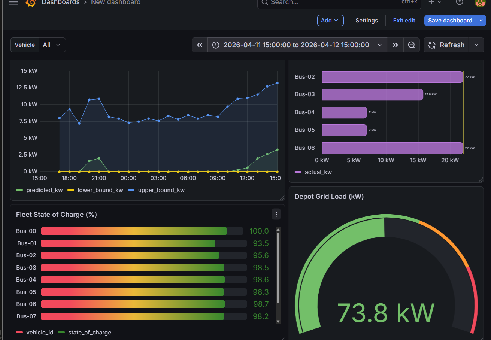
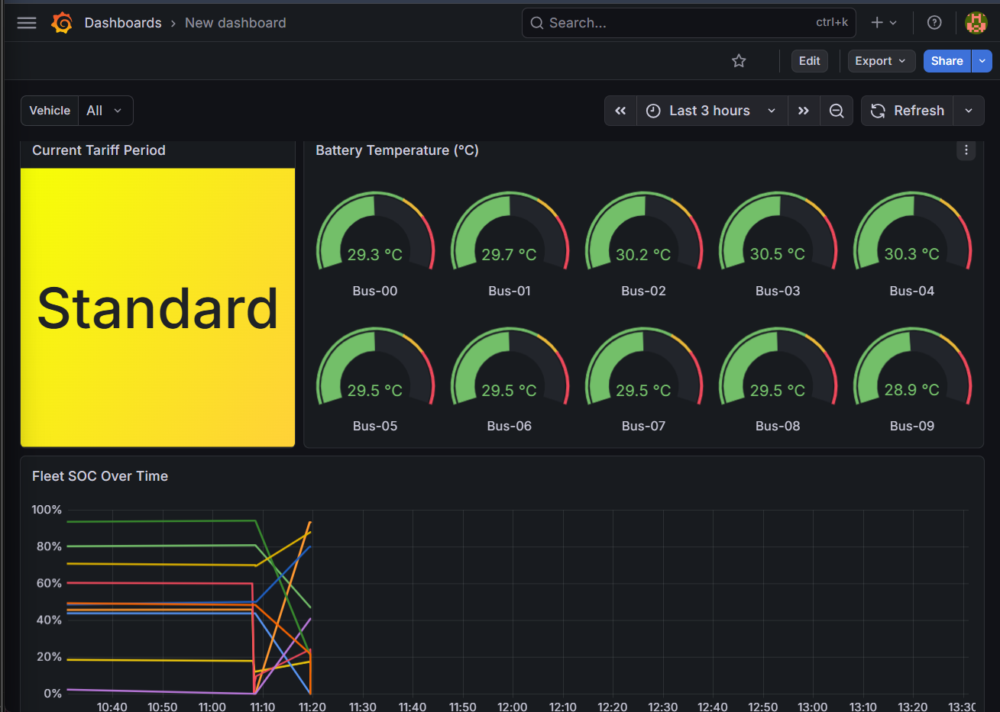

# EV Fleet Charging Optimizer & Grid Load Prediction System

Production-grade serverless cloud data engineering system — real-time EV fleet telemetry, Medallion data lake, intelligent charging optimisation, containerised ML demand forecasting, and live operational dashboard. Fully deployed on AWS, managed via Terraform IaC, with CI/CD via GitHub Actions.

---

## Dashboard


*Real-time Grid Load, Fleet SOC, and Prophet Demand Forecasting*


*Battery Thermal Monitoring and Tariff Period tracking*

---

## Quick Start

**Infrastructure**
```bash
git clone https://github.com/Mayne0945/ev-fleet-charging-optimizer.git
cd ev-fleet-charging-optimizer
terraform init
terraform apply
```

**Run the simulation**
```bash
export AWS_PROFILE=personal
aws events enable-rule --name ev-fleet-gold-schedule --region eu-west-1
aws events enable-rule --name ev-fleet-optimizer-schedule --region eu-west-1
python3 simulation/fleet_manager.py
```

Estimated AWS cost: under $5/month at simulation scale. EventBridge schedules disabled between sessions to eliminate idle cost.

---

## Stack

| Category | Technology |
|---|---|
| Cloud | AWS eu-west-1 (Ireland) |
| IaC | Terraform hashicorp/aws v6.35.1 |
| CI/CD | GitHub Actions — OIDC, plan on PR, apply on merge |
| Ingestion | Amazon SQS Standard + DLQ |
| Compute | AWS Lambda Python 3.11 |
| Forecaster | Docker on Amazon ECR — Prophet 1.1.5, CmdStan 2.38.0 |
| Storage | S3 Bronze / Silver / Gold (Medallion Architecture) |
| Data Format | JSON (Bronze) → Parquet Snappy (Silver) → JSON snapshots (Gold) |
| Schema Registry | AWS Glue Data Catalog |
| Query Engine | Amazon Athena |
| State Store | Amazon DynamoDB — PAY_PER_REQUEST, 24hr TTL |
| Scheduling | Amazon EventBridge |
| ML Framework | Meta Prophet 1.1.5 + CmdStan 2.38.0 C++ backend |
| Dashboard | Grafana OSS — Athena plugin |
| Simulation | Python asyncio + boto3 |

---

## Architecture

```
Fleet Simulation (10 EVBus coroutines, 600x time multiplier)
  → SQS Queue + DLQ (guaranteed delivery)
  → Lambda Ingestor → S3 Bronze (raw JSON archive)
  → Lambda Transformer → S3 Silver (Parquet, partitioned year/month/day)
  → AWS Glue + Athena (SQL query engine)
  → Lambda Gold Aggregator → S3 Gold (fleet snapshots, every 5 min)
  → Lambda Optimizer (DLM allocation, per-vehicle decisions, every 5 min)
  → Lambda Forecaster on ECR (Prophet 24hr forecast, every 1 hr)
  → Grafana OSS Dashboard (8 panels, Athena plugin)
```

---

## Optimizer and Dynamic Load Management

On every optimizer run, a single-threaded DLM allocation pass executes before the decision tree. It reads all vehicles from DynamoDB, ranks them by urgency score descending, and distributes the 150kW depot budget proportionally by urgency weight. Each CHARGE_NOW assignment reduces the remaining budget before the next vehicle is evaluated — preventing simultaneous over-allocation. Vehicles that cannot be served receive QUEUE_FOR_CHARGING and are re-evaluated on the next run when headroom is available.

**Decision Tree (Priority Order)**

| Priority | Decision | Condition |
|---|---|---|
| 1 | DO_NOT_CHARGE | battery_temp >= 45°C — thermal safety override |
| 2 | EMERGENCY_RETURN | en_route AND SOC <= 10% |
| 3 | STANDBY (transit) | moving and not connected |
| 4 | CHARGE_NOW | urgency >= 60 AND grid has headroom |
| 5 | QUEUE_FOR_CHARGING | urgency >= 60 AND grid at capacity |
| 6 | CONTINUE_CHARGING | connected AND medium+ urgency |
| 7 | DEFER_CHARGING | peak tariff AND urgency < 40 |
| 8 | STANDBY | default |

Urgency formula: `(time_pressure × 0.6) + (soc_weight × 0.4)` — range 0–100

Peak tariff evasion: During peak hours (07:00–10:00 and 17:00–21:00 SAST), effective depot capacity drops to 30kW. Only vehicles with urgency >= 80 break through.

---

## Demand Forecasting

Containerised Lambda (Docker on ECR) queries 30 days of Silver telemetry via two-level Athena aggregation, fits Prophet with CmdStan C++ backend, and produces a 24-hour-ahead forecast with 80% confidence intervals.

**Why Docker:** CmdStan C++ backend exceeds the 250MB Lambda zip limit. Container images support up to 10GB.

**Training data aggregation:** Naive SUM of `charger_kw` inflates values 50–500x. Correct approach: AVG per vehicle per hour (inner query), SUM across vehicles (outer query). Max realistic output: 10 vehicles × 50kW = 500kW.

**SA Context:** Prophet trained with `add_country_holidays(country_name='ZA')` and custom daily seasonality (`fourier_order=10`) to capture sharp morning/evening EV bus shift patterns. Training data converted UTC → SAST before model fit so learned patterns align with local tariff windows.

---

## Grafana Dashboard

| Panel | Type | Source |
|---|---|---|
| Fleet State of Charge (%) | Bar gauge | Silver |
| Depot Grid Load (kW) | Gauge | Silver |
| Fleet Vehicle Status | Table | Silver |
| Current Tariff Period | Stat tile | Silver |
| Active Charging kW per Vehicle | Bar chart | Silver |
| Fleet SOC Over Time | Time series | Silver |
| Battery Temperature | Gauge | Silver |
| 24-Hour Demand Forecast | Time series | Gold |

Vehicle dropdown variable for per-bus drill-down across relevant panels.

---

## CI/CD Pipeline

```
Pull Request  →  terraform plan  →  plan output posted as PR comment
Merge to main →  terraform apply →  infrastructure updated automatically
```

Authentication via OIDC. No long-lived AWS access keys stored in GitHub secrets.

---

## Key Engineering Decisions

| Decision | Choice | Rationale |
|---|---|---|
| Ingestion buffer | SQS not Kinesis | One consumer, pay-per-message, no idle shard cost |
| Silver format | Parquet + Snappy | Columnar, Athena predicate pushdown |
| DynamoDB billing | PAY_PER_REQUEST | No idle cost, auto-scales |
| Gold reads DynamoDB not Athena | Single source of truth | Dashboard always agrees with optimizer |
| Lambda container for Prophet | Docker on ECR | CmdStan C++ exceeds 250MB zip limit |
| Grafana over QuickSight | OSS + Athena plugin | QuickSight per-session pricing prohibitive |
| Terraform from day one | Not a future enhancement | All resources version-controlled from first commit |
| DLM inside optimizer.py | Not a separate Lambda | Optimizer holds all state — separate Lambda adds cold start with no benefit |

---

## Bugs Solved

| Bug | Root Cause | Fix |
|---|---|---|
| DLM always 0kW | Boolean `True` != string `"true"` in DynamoDB filter | `.eq(True)` throughout |
| Simulator ignored optimizer | No DynamoDB read in fleet manager loop | Added DLM sync coroutine every 5 ticks |
| Gold and Optimizer disagreed | Duplicate decision engine in Gold Aggregator | Removed, Gold reads from DynamoDB |
| Timeline fracture at 600x | EventBridge 5-min = 3000 simulated minutes | Fleet manager invokes optimizer every 30 real seconds |
| Prophet data inflated 500x | Naive SUM across hundreds of snapshots per hour | Two-level aggregation: AVG per vehicle, SUM across vehicles |
| Prophet stale forecast | `charger_kw > 0` excluded idle periods | Removed filter, resampled timeline anchor to current hour |
| Prophet timezone error | UTC metadata in datetime column | `.dt.tz_localize(None)` before `model.fit()` |
| Lambda handler mismatch post CI/CD | File renamed and handler updated in separate commits | Always rename file and update handler in the same commit |

---

## Author

Tshifhiwa Gift Moila — Cloud Data Engineer  
Johannesburg, South Africa — April 2026